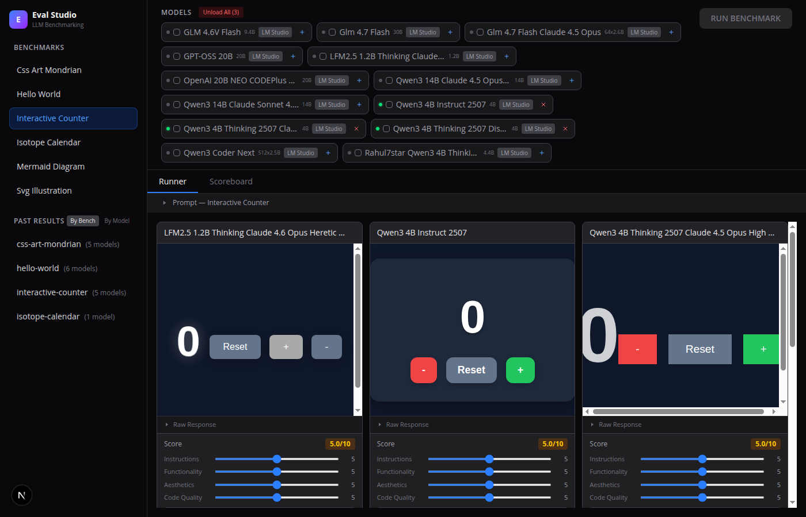
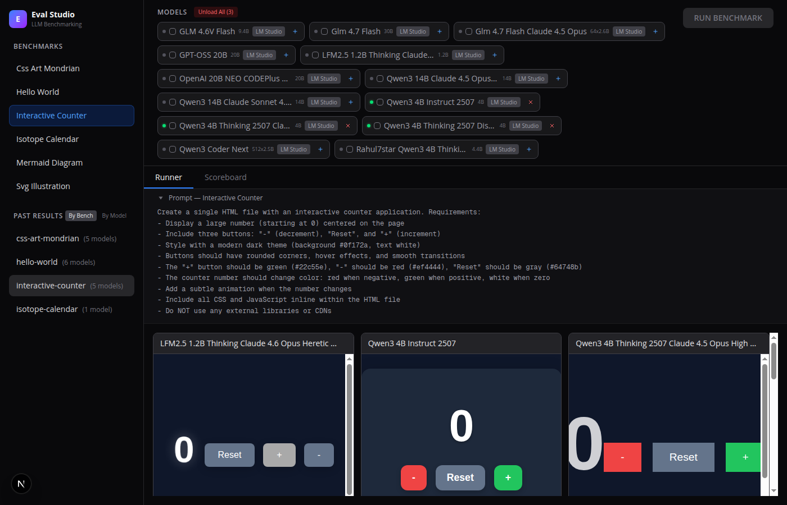
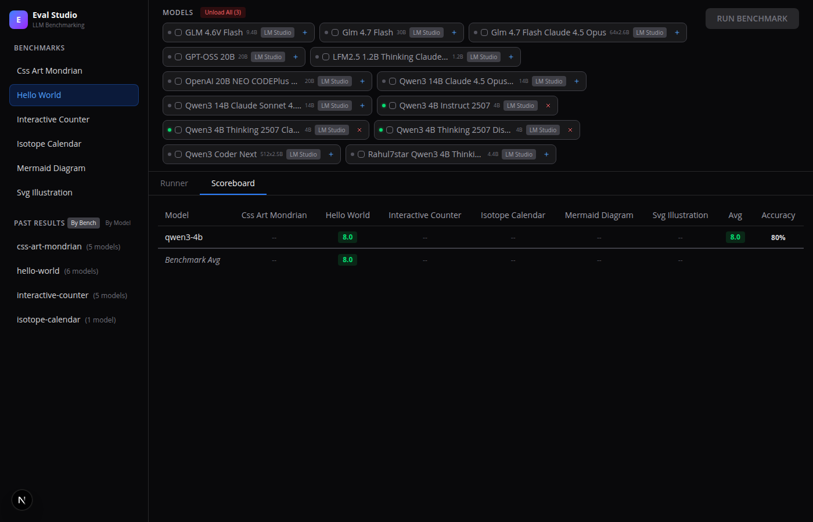

<p align="center">
  
</p>

<h1 align="center">Eval Studio</h1>

<p align="center">
  <strong>The open-source LLM benchmarking tool for frontend code generation.</strong><br>
  Run prompts against multiple models, render outputs side-by-side, and score them — all in one place.
</p>

<p align="center">
  <a href="#features">Features</a> &bull;
  <a href="#quickstart">Quickstart</a> &bull;
  <a href="#benchmarks">Benchmarks</a> &bull;
  <a href="#scoring">Scoring</a> &bull;
  <a href="#adding-models">Adding Models</a> &bull;
  <a href="#adding-benchmarks">Adding Benchmarks</a>
</p>

---

## Why Eval Studio?

You download a new GGUF from HuggingFace. "How good is it at writing frontend code?" You paste the same prompt into LM Studio, copy the output, open it in a browser, squint at it, then do it again for the next model. **That workflow is broken.**

Eval Studio automates the entire loop: send the same prompt to N models in parallel, extract the HTML, render each output in a sandboxed iframe, and display them side-by-side so you can actually compare. Then score them with sliders and track results over time in a scoreboard.

## Features

**Side-by-side comparison** — Run the same benchmark against multiple models simultaneously and see every output rendered live in sandboxed iframes.

<p align="center">
  
</p>

**Manual scoring system** — Rate each output on Instructions, Functionality, Aesthetics, and Code Quality (0-10 sliders). Scores persist across sessions.

**Aggregate scoreboard** — See how every model performs across all benchmarks at a glance, with color-coded cells and accuracy percentages.

<p align="center">
  
</p>

**LM Studio integration** — Auto-discovers all downloaded models. Load/unload models from the UI. Green dot = loaded in memory, gray = on disk.

**Parallel execution** — All selected models run simultaneously. Results appear as each model finishes.

**Raw response viewer** — Expand "Raw Response" on any result to see exactly what the model generated, including thinking tokens.

**Smart code extraction** — Handles `<think>` blocks, `<answer>` tags, multiple code fences, and picks the right HTML from messy LLM output.

**Past results browser** — Browse previous runs by benchmark or by model. Click to instantly reload any past comparison.

**Run All mode** — Select one model, hit "RUN ALL" to execute every benchmark sequentially.

## Quickstart

```bash
# Clone
git clone https://github.com/ESJavadex/eval-studio.git
cd eval-studio

# Install
npm install

# Configure your model provider (LM Studio example pre-configured)
# Edit config/models.json to add API providers

# Run
npm run dev
```

Open [http://localhost:3000](http://localhost:3000). Select a benchmark from the sidebar, check some models, and hit **RUN BENCHMARK**.

### Prerequisites

- **Node.js 18+**
- **An OpenAI-compatible API** — [LM Studio](https://lmstudio.ai), [Ollama](https://ollama.ai), [vLLM](https://github.com/vllm-project/vllm), OpenAI, Anthropic, or any provider with a `/v1/chat/completions` endpoint.

## Benchmarks

Eval Studio ships with 6 benchmarks out of the box:

| Benchmark | What it tests |
|-----------|--------------|
| **Hello World** | Basic HTML/CSS, gradient backgrounds, text centering |
| **Interactive Counter** | JavaScript interactivity, button styling, state management |
| **CSS Art Mondrian** | Pure CSS art, complex layouts, color theory |
| **Isotope Calendar** | Date math, grid layouts, dynamic UI generation |
| **SVG Illustration** | Inline SVG, animations, complex visual composition |
| **Mermaid Diagram** | CDN integration, Mermaid.js rendering, multiple diagram types |

## Scoring

Each result can be scored on 4 criteria (0-10):

- **Instructions** — Did it follow the prompt?
- **Functionality** — Does it work correctly?
- **Aesthetics** — Visual quality and design
- **Code Quality** — Clean, correct code

Scores are stored in `public/results/scores.json` and aggregated in the Scoreboard tab. The scoring system is designed to be pluggable — swap `"manual"` for a model ID to use an LLM-as-judge.

## Adding Models

### Auto-discovery (LM Studio)

Models are auto-discovered from providers in `config/models.json`:

```json
{
  "providers": [
    {
      "id": "lmstudio",
      "name": "LM Studio",
      "baseUrl": "http://localhost:1234/v1",
      "apiKey": "not-needed",
      "type": "openai"
    }
  ],
  "models": []
}
```

Every model downloaded in LM Studio appears automatically. The `models[]` array is for manual overrides or non-discoverable APIs (e.g., OpenAI, Anthropic).

### Manual model entry

```json
{
  "models": [
    {
      "id": "gpt-4o",
      "name": "GPT-4o",
      "baseUrl": "https://api.openai.com/v1",
      "apiKey": "env:OPENAI_API_KEY",
      "defaultModel": "gpt-4o",
      "provider": "openai"
    }
  ]
}
```

API keys support `env:VAR_NAME` syntax to read from environment variables.

## Adding Benchmarks

Create a directory in `benchmarks/` with a `prompt.txt`:

```
benchmarks/
  my-new-test/
    prompt.txt    # The prompt sent to models
```

It appears in the sidebar on next page load. The name is derived from the directory (kebab-case to Title Case).

## Tech Stack

- **Next.js 16** (App Router) + **React 19** + **TypeScript**
- **Tailwind CSS 4** — dark theme
- **No database** — all file-based (`public/results/`)
- **No external dependencies** for inference — just HTTP to any OpenAI-compatible API

## Project Structure

```
config/
  models.json           # Provider + model configuration
  scoring.json          # Scoring criteria definitions
benchmarks/
  hello-world/prompt.txt
  interactive-counter/prompt.txt
  ...
src/
  app/page.tsx          # Main orchestrator
  app/api/              # REST endpoints
  components/           # UI components
  lib/
    benchmark-runner.ts # Model calling + code extraction
    lmstudio.ts         # LM Studio native API (load/unload)
    models.ts           # Auto-discovery from providers
public/results/         # Saved HTML outputs + scores
```

## License

MIT

---

<p align="center">
  Built by <a href="https://esjavadex.es"><strong>Javi</strong></a> (<a href="https://github.com/ESJavadex">@ESJavadex</a>)
</p>
